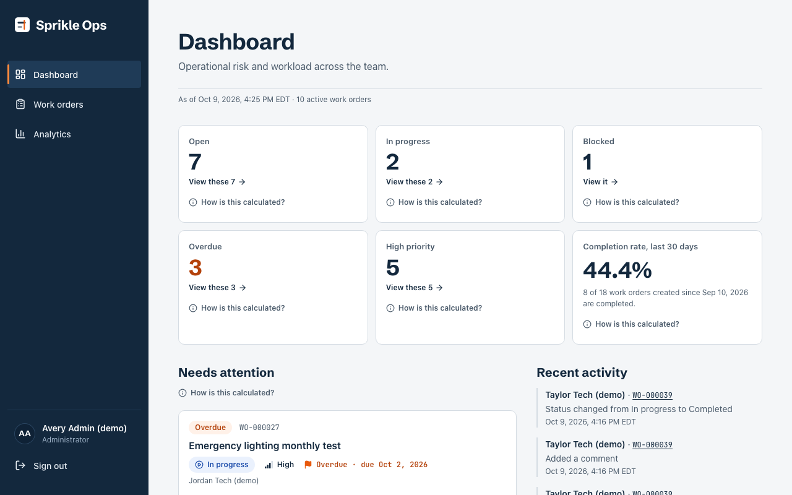
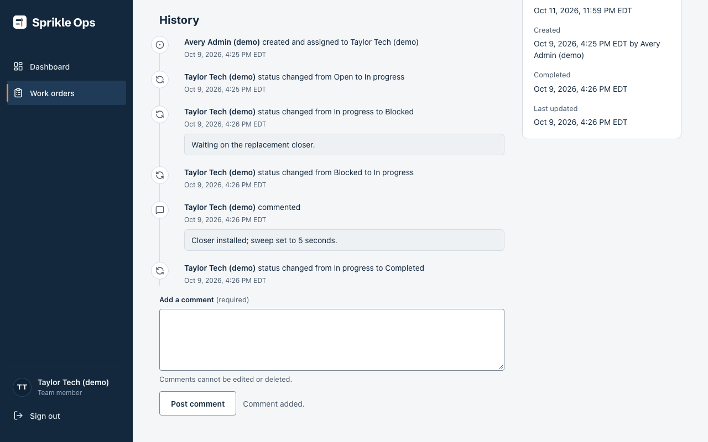
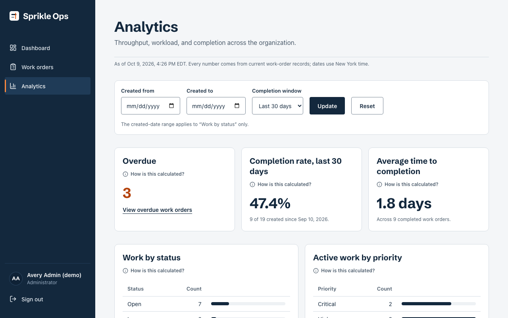
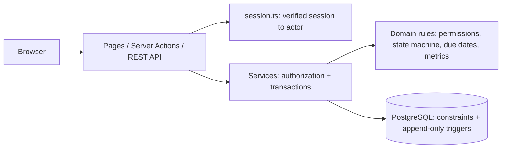

# Sprikle Ops

A full-stack work-order system for small service businesses: an operations manager creates and
assigns jobs, technicians update the work assigned to them, every change is recorded with who made
it and when, and the dashboard and analytics are computed from the stored records.

Built as a portfolio project with production-style engineering: server-enforced authorization,
an audited state machine, optimistic concurrency, time-zone-correct due dates, and unit,
integration, and browser tests against a real PostgreSQL database. It runs locally: there is no public
deployment, no AI capability, and no real users or customers.



| Work-order history                                             | Analytics                                    |
| -------------------------------------------------------------- | -------------------------------------------- |
|  |  |

A 5-minute walkthrough script is in [docs/demo.md](docs/demo.md) with a recording at
[docs/media/demo-walkthrough.webm](docs/media/demo-walkthrough.webm).

## What it does

| Area         | Behavior                                                                                                                                                                                       |
| ------------ | ---------------------------------------------------------------------------------------------------------------------------------------------------------------------------------------------- |
| Sign-in      | Email and password (Better Auth), two roles (`ADMIN`, `TEAM_MEMBER`), no public sign-up, deactivated users treated as signed out, rate-limited sign-in, safe return paths.                     |
| Work orders  | Create, edit, assign, comment; references like `WO-000123`; no hard deletes. Status changes follow a fixed state machine; blocking needs a note, cancelling needs a confirmed reason.          |
| Access rules | Administrators see everything. Team members see and act only on work currently assigned to them; anything else is a 404, exactly like a missing reference.                                     |
| History      | Every change writes an append-only activity entry in the same transaction; comments and notes cannot be edited or deleted (enforced by database triggers).                                     |
| Concurrency  | Each work order has a version; a stale update gets "This work order was updated by someone else. Reload to see the latest version." and changes nothing.                                       |
| List         | Search (reference, number, title, description), filters (status, priority, assignee, service area, due), sort, and pagination, all in the URL; distinct "no data" and "no matches" states.     |
| Dashboard    | Open, in progress, blocked, overdue, and high-priority counts that link to lists with the same totals; 30-day completion rate; Needs Attention; recent activity. Team members see their scope. |
| Analytics    | Administrators only: work by status and priority, workload per person, 12-week created/completed trend, completion rate, average time to completion. Every chart has a table and a definition. |
| Dates        | All dates use New York time; a date-only due date ends at local midnight; DST-aware day and week windows.                                                                                      |

## Technology

TypeScript 6 (strict) · Next.js 16 App Router (Server Components, Server Actions, route handlers)
· React 19 · Tailwind CSS 4 · PostgreSQL 16 (Docker Compose) · Prisma 7 with the `pg` adapter ·
Better Auth 1.7 · Zod 4 · Vitest 5 · Playwright 1.63 (Chromium) · ESLint 9 · Prettier · pnpm 10 ·
Node.js 24 · GitHub Actions (workflow included, see [CI](#continuous-integration)).

## Architecture

Pages, Server Actions, and the REST API are thin adapters over one service layer; services apply
pure, unit-tested domain rules and write each change plus its audit entry in a single transaction.



Details, trade-offs, and a full diagram: [docs/architecture.md](docs/architecture.md). Authorization
model: [docs/authorization.md](docs/authorization.md). API: [docs/api.md](docs/api.md).

## Run it locally

Requirements: macOS or Linux, Node.js 24 (`.nvmrc`), pnpm 10.34.6 through Corepack
(`corepack enable pnpm`), Docker with 2–3 GB of memory.

```bash
pnpm install --frozen-lockfile   # also generates the Prisma client
pnpm env:init                    # creates .env with random local secrets; never overwrites an existing .env
                                 # (existing .env from an older checkout: pnpm env:init --add-missing)
pnpm db:up                       # PostgreSQL 16 on 127.0.0.1, waits until healthy
pnpm db:migrate                  # applies migrations to the development database (sprikle_ops)
pnpm db:seed:auth                # four synthetic demo accounts (existing accounts are left unchanged)
pnpm db:seed:demo                # demo work orders through the real services (refuses if any exist)
pnpm dev                         # http://localhost:3000
```

Sign in at http://localhost:3000/login with one of the accounts below. They share one password,
generated into your ignored `.env` as `SEED_DEMO_PASSWORD` (view it with
`grep '^SEED_DEMO_PASSWORD=' .env`); it is never committed.

| Email                   | Role        | Status                        |
| ----------------------- | ----------- | ----------------------------- |
| `admin@sprikle.test`    | Admin       | active                        |
| `tech.one@sprikle.test` | Team member | active                        |
| `tech.two@sprikle.test` | Team member | active                        |
| `inactive@sprikle.test` | Team member | inactive (sign-in is refused) |

Ports: PostgreSQL uses `127.0.0.1:5432` and the app `localhost:3000`. If 5432 is taken, edit `.env`
before `pnpm db:up`: set `POSTGRES_PORT` and the same port in `DATABASE_URL` and `TEST_DATABASE_URL`.
If the app runs on another port, set `BETTER_AUTH_URL` to match (it is the trusted origin for
sign-in). The Compose project is named `sprikle-ops`; a second checkout on the same machine needs
`COMPOSE_PROJECT_NAME=<other-name>` so it gets its own container and volume.

Environment variables are documented in [`.env.example`](.env.example) and validated at startup
(`src/lib/env.ts`). Stop the database with `pnpm db:stop` (data is kept); never use
`docker compose down -v`, which deletes the data volume. `pnpm db:migrate` runs
`prisma migrate dev`; if it ever offers to reset the database because of drift, decline.

Other database commands: `pnpm db:status`, `pnpm db:psql`, `pnpm db:rotate:demo-password` (rotates
the demo password end to end without printing it; see [docs/implementation-log.md](docs/implementation-log.md)).

## Verification

```bash
pnpm check              # format, lint (0 warnings), typecheck, unit tests + coverage thresholds,
                        # unit tests under three process time zones, production build
pnpm test:integration   # migrations + integration tests against sprikle_ops_test
pnpm test:e2e           # Playwright: production build on 127.0.0.1:3100 + sprikle_ops_test
pnpm perf:explain       # query plans on 5,000 synthetic rows in sprikle_ops_test
```

The browser suite needs Chromium's headless shell once:
`pnpm exec playwright install --only-shell chromium`.

Latest full run (2026-10-09): 538 unit tests (each of four runs), coverage 99.36% statements and
98.96% branches over `src/domain` and `src/validation`; 101 integration tests; 27 browser tests.
Exact commands and results: [docs/implementation-log.md](docs/implementation-log.md).

**Test isolation.** Integration and browser tests run only against a database named exactly
`sprikle_ops_test` on a local host. A fail-closed guard (`tests/helpers/database-safety.ts`) checks
both the development and test URLs before anything connects, and every cleanup re-checks
`current_database()` on the same connection before truncating. Browser tests serve a fresh
production build, create random-password synthetic users that exist only in the test database,
keep traces/videos/screenshots off, and respect the real sign-in rate limiter (the suite waits out
its window instead of weakening it). See [docs/test-strategy.md](docs/test-strategy.md).

## Continuous integration

[`.github/workflows/ci.yml`](.github/workflows/ci.yml) runs the same commands in three jobs (check,
integration with a PostgreSQL service container, Playwright E2E). It uses no repository secrets:
the database is a throwaway container and the auth secret is generated per job. The workflow has
not been run on GitHub yet; it activates once the repository is pushed.

## Key engineering decisions

- Authorization is enforced in services on every call; the UI and the routing proxy are
  conveniences, not boundaries ([architecture](docs/architecture.md#key-decisions-and-trade-offs)).
- Out-of-scope work returns a real HTTP 404 (detail pages deliberately avoid streaming before the
  access check).
- Status changes are commands (`POST /transitions`), so each produces exactly one audited event.
- Metrics are SQL aggregates that integration tests check against pure definitions
  ([docs/metrics.md](docs/metrics.md)); dashboard cards must equal their linked list totals.
- Seeded demo history is produced by the real services, so it obeys the same rules as user input.

## Known limitations and deferred work

- Local-only: no hosted deployment, no production `Dockerfile`, and the sign-in limiter uses one
  shared in-memory bucket (a deployment needs a trusted client-IP configuration).
- Single organization and one time zone (`America/New_York`); no user or service-area management
  UI (accounts and areas come from seed scripts).
- No notifications, attachments, customer portal, billing, scheduling, or AI features.
- Deferred should-haves: automated accessibility scanning (`@axe-core/playwright`), median time to
  completion and on-time rate, trigram search index, created-date range filter (and with it the
  completion-rate cohort link), password change, CSV export.
- `pnpm audit` reports four advisories (three high, one moderate) in packages installed through
  the Prisma CLI (`mysql2`, `deepmerge-ts`) and ESLint's Next.js plugin (`braces`). None is loaded by
  the application at runtime or included in the production build; no supported fix exists yet for
  any of them. Details, exposure, and options: [docs/security-advisories.md](docs/security-advisories.md).
- The public landing page's "Request a demo" destination is not configured (`src/config/contact.ts`);
  it shows "Contact details coming soon".
- The optional Brindle design experiment is not part of the product (see below).

## Database migrations

The release contains exactly three migrations (`prisma/migrations/`), applied in order by
`pnpm db:migrate` (development) and `prisma migrate deploy` (test database, CI):

| Migration                                 | Contents                                                                                                                                                                                |
| ----------------------------------------- | --------------------------------------------------------------------------------------------------------------------------------------------------------------------------------------- |
| `20261006004807_init`                     | Enums; `users`, `service_areas`, `work_orders`, `work_order_comments`, `work_order_activities`; foreign keys, indexes, CHECK constraints, append-only triggers on comments and activity |
| `20261006005042_audit_trigger_error_code` | Replaces the append-only trigger function to raise a specific error code                                                                                                                |
| `20261006020855_add_auth_tables`          | Better Auth `sessions`, `accounts`, `verifications` tables and their indexes                                                                                                            |

## Optional design experiment (not part of the product)

`src/app/prototypes/brindle/` is a local marketing-hero study kept for reference: a GSAP-animated
scene over illustrative sample data, with no reads or writes. It is the only code that uses `gsap`,
`@gsap/react`, and `lenis`, and it includes vendored React Bits and Magic UI components with their
licenses. Run `pnpm dev` and open http://localhost:3000/prototypes/brindle (no database or sign-in
needed). Production builds return 404 for `/prototypes/*`. Details:
[src/app/prototypes/README.md](src/app/prototypes/README.md). Everything else under `src/` is the
working application.

## Documentation

[Product requirements](docs/product-requirements.md) · [Architecture](docs/architecture.md) ·
[Authorization](docs/authorization.md) · [API](docs/api.md) · [Data model](docs/data-model.md) ·
[Metrics](docs/metrics.md) · [Test strategy](docs/test-strategy.md) ·
[Query plans](docs/performance.md) · [Demo script](docs/demo.md) ·
[Project evidence](docs/project-evidence.md) · [Security advisories](docs/security-advisories.md) ·
[Third-party licenses](docs/third-party-licenses.md) ·
[Decision records](docs/decisions/) · [Implementation log](docs/implementation-log.md)
