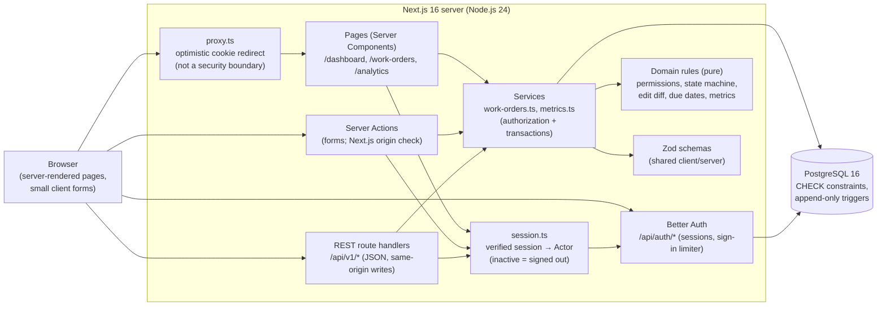

# Architecture

Brindle is a single Next.js application (App Router) backed by PostgreSQL. There is one
deployable unit and one database; the layering below is enforced by module boundaries and lint
rules, not by separate services.

## Request flow



## Layers

| Layer                | Location                                                      | Responsibility                                                                                                                                                                                                                  |
| -------------------- | ------------------------------------------------------------- | ------------------------------------------------------------------------------------------------------------------------------------------------------------------------------------------------------------------------------- |
| Domain rules         | `src/domain/`                                                 | Pure functions: permission decisions, the status state machine, edit diffing, due/overdue rules, New York calendar math, metric definitions. `now` is always a parameter. Lint forbids server imports and implicit clocks here. |
| Validation           | `src/validation/`                                             | Strict Zod schemas shared by forms, Server Actions, and the REST API (unknown fields rejected, text trimmed before length checks).                                                                                              |
| Services             | `src/server/services/`                                        | The only code that changes data. Each call re-checks the actor, validates, plans with the domain rules, and writes the change and its audit activity in one transaction guarded by `version`.                                   |
| Adapters             | `src/app/**/actions.ts`, `src/server/api/`, `src/app/api/v1/` | Thin: resolve the actor from the verified session, call a service, map the typed result to a redirect, form state, or JSON response.                                                                                            |
| Pages and components | `src/app/(app)/`, `src/components/`                           | Server-rendered pages; client components only for forms and dialogs.                                                                                                                                                            |
| Database             | `prisma/`                                                     | Schema, migrations, CHECK constraints (lengths, status/timestamp consistency, assignee required), append-only triggers on comments and activity.                                                                                |

## Key decisions and trade-offs

- **Authorization lives in the services, not the UI or the proxy.** Hidden buttons are a
  convenience; every Server Action and API handler re-resolves the session and every service
  re-applies the pure permission rules. The proxy only redirects requests with no session cookie at
  all (CVE-2025-29927 showed middleware can be bypassed).
- **Out-of-scope work is a 404, not a 403.** A team member asking for work not currently assigned to
  them gets the same response as for a missing reference, so references cannot be probed (D3, Q17).
  Pages that can 404 have no streaming `loading.tsx` above them, so the status code is a real 404
  rather than a streamed "soft" 404.
- **Audit trail in the same transaction.** Every mutation writes its activity row inside the same
  database transaction; database triggers make comments and activity append-only. The current
  status of every work order equals the target of its latest status-change event (tested).
- **Optimistic concurrency.** Updates are `WHERE id = ? AND version = ?`; a lost race returns 409
  and rolls back everything, including notes (tested with two concurrent requests).
- **Status changes are commands.** `POST /transitions` instead of a PATCH field keeps the state
  machine explicit and produces exactly one `STATUS_CHANGED` event per change.
- **Metrics are SQL aggregates checked against pure definitions.** Integration tests recompute every
  dashboard and analytics number from the raw records with `src/domain/metrics.ts` and require
  equality; dashboard count cards must equal the totals of the lists they link to.
- **One time zone (`America/New_York`).** Date-only due dates end at local midnight; day and week
  windows are DST-aware; unit tests run under three process time zones.
- **Local-first, single tenant.** No multi-tenancy, notifications, or deployment in the MVP. The
  sign-in limiter is Better Auth's in-memory limiter with one shared bucket (no trusted proxy IP);
  a deployment would need a trusted client-IP configuration.

## Directory map

```
src/
  app/(public)/        landing page, login
  app/(app)/           authenticated pages: dashboard, work-orders, analytics, profile
  app/api/             health, Better Auth handler, /api/v1 REST adapters
  components/          shell, UI kit, work-order and metric components
  domain/              pure business rules (no I/O)
  validation/          shared Zod schemas
  server/              session, auth, db client, services, API adapter
  lib/                 env validation, formatting, labels, safe return paths
prisma/                schema and migrations
scripts/               env setup, seeds, guarded test-data and query-plan scripts
tests/unit, tests/integration, e2e/
```

The optional Brindle design experiment (`src/app/prototypes/brindle/`, not part of the product) is
served only by `next dev`; production builds return 404 for it.
